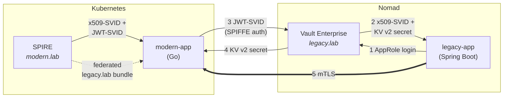

# SPIFFE + Vault SVID Federation Lab

This lab showcases two Vault features in a single end-to-end flow:

1. **Vault SPIFFE Auth (Enterprise)** — the modern app authenticates to Vault using a JWT-SVID issued by SPIRE.
2. **Cross-domain SVID issuance from Vault PKI** — the legacy app mints an x509-SVID from Vault and uses it for mTLS with the modern app across federated trust domains.

## Architecture

Two trust domains, two runtimes, one mTLS handshake:

| Component | Runtime | Trust Domain | Identity Source |
|-----------|---------|--------------|-----------------|
| `modern-app` (Go) | Kubernetes | `modern.lab` | SPIRE Workload API |
| `legacy-app` (Spring Boot) | Nomad batch job | `legacy.lab` | Vault PKI |
| Vault Enterprise | Nomad service | `legacy.lab` | — |
| SPIRE | Kubernetes | `modern.lab` | — |



**Data flow:**

1. Legacy app logs into Vault via AppRole, mints a short-lived x509-SVID (`spiffe://legacy.lab/ns/legacy/sa/springboot`), and reads a KV v2 secret.
2. Modern app receives its x509-SVID and JWT-SVID from SPIRE, uses the JWT-SVID to authenticate to Vault (SPIFFE auth), and reads the same KV v2 secret.
3. Legacy app calls the modern app over mTLS. Modern app validates the legacy client against the federated `legacy.lab` bundle from SPIRE.

The legacy root CA private key never leaves Vault. SPIRE manages bundle federation for the modern app automatically; the legacy app receives the modern root CA explicitly at deploy time.

## Prerequisites

- `kind`, `kubectl`, `docker`, `nomad`, `openssl`, `curl`, `jq`
- A Vault Enterprise license file at `.lab/vault.hclic`

## Quickstart

```bash
./scripts/lab.sh up              # stand up everything
./scripts/lab.sh legacy          # run the legacy app batch job
./scripts/lab.sh verify          # verify federation end-to-end
./scripts/lab.sh verify-negative # prove enforcement (removes bundle, expects failure)
./scripts/lab.sh down            # tear down
```

## Commands

| Command | Description |
|---------|-------------|
| `./scripts/lab.sh up` | Create kind cluster, start Nomad + Vault, deploy SPIRE, configure Vault PKI/AppRole/SPIFFE auth, build and deploy modern app |
| `./scripts/lab.sh legacy` | Build legacy app image, submit Nomad batch job, print logs |
| `./scripts/lab.sh verify` | Confirm Vault CA matches SPIRE bundle, run legacy job, assert mTLS success + KV reads |
| `./scripts/lab.sh verify-negative` | Remove federation bundle, assert mTLS failure, restore |
| `./scripts/lab.sh status` | Show Kubernetes pods and Nomad job status |
| `./scripts/lab.sh logs <target>` | Tail logs (`modern`, `spire`, `vault`) |
| `./scripts/lab.sh down` | Stop Nomad jobs/agent, delete kind cluster |

All underlying scripts in `scripts/` work standalone (e.g., `./scripts/lab-up.sh`).

## Notes

- Teaching lab — not production hardened.
- Vault Enterprise runs in server mode with in-container raft storage; the root token is generated on init and saved to `.lab/lab-secrets.env`.
- Legacy SVIDs default to 5-minute TTL (configurable via `LAB_SVID_TTL`). Each batch run mints a fresh SVID.
- No secrets are hardcoded. All seed values are generated by `scripts/primer.sh` (called automatically by `lab.sh up`).
